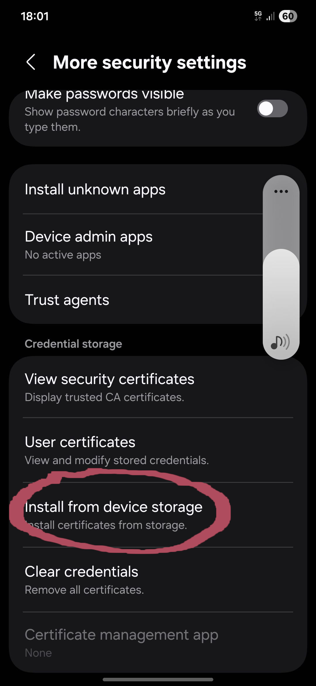
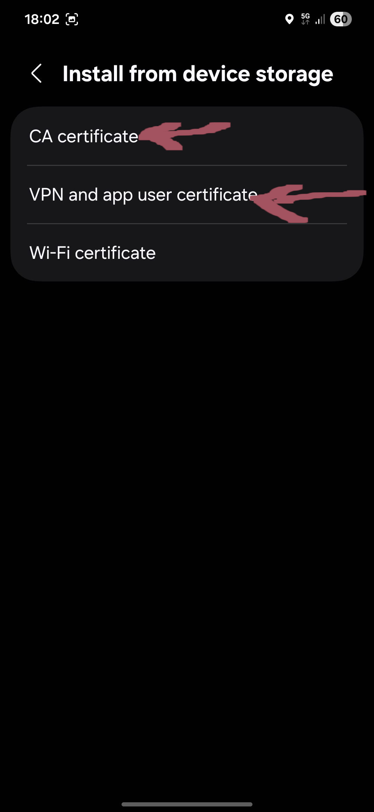
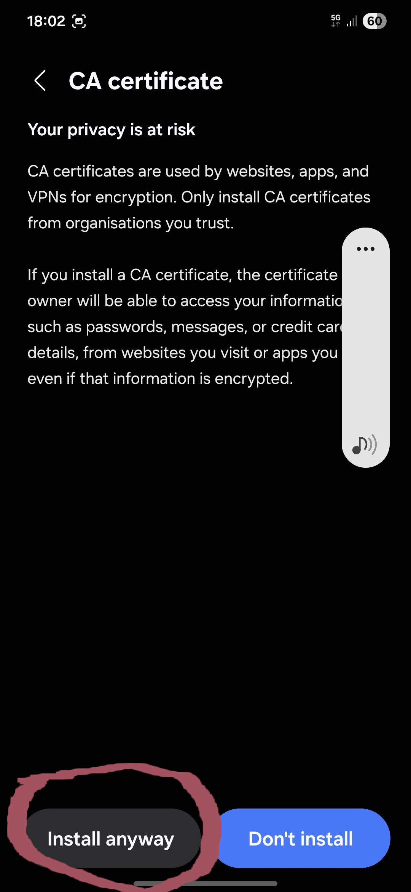
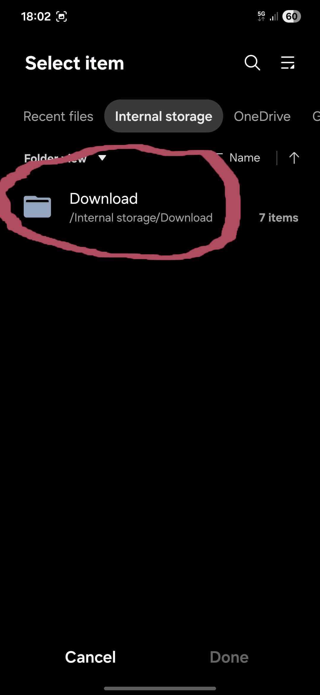
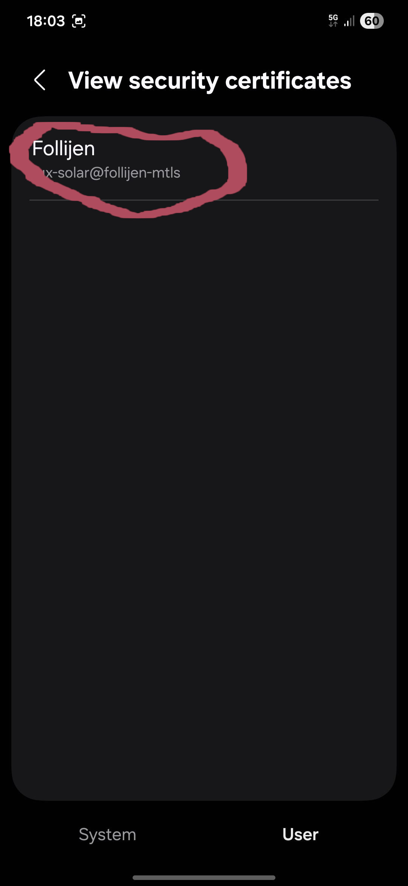

# mTLS authentication with gnuTLS

Object: mTLS authentication with gnuTLS
Author: Fulup Le Foll (fulup@iot.bzh)
License: MIT
Date: march-2026

## Why using mTlS for your personal hosted service

While it is almost strait forward to use let's encrypt to implement TLS on a home/personal hosted service. Some issues remains. Let's encrypt and equivalent authenticate the server. Those systems allow an anonymous client to assert it accesses the right server. For personal/home usage we are more interested in authenticating the client. What we want it to make sure that no "bad-client" may enter home system. For this mTLS with client side certificate is required. 

With mTLS client authentication you have the guarantee that a client (browser, imap, api ...) can only access your hosted service with the right client-identity sign by you. It is the only valid alternative to a VPN.

## Edit certificate template to match your situation

   * templ-auth.cfg: MAY change your certificate identity
   * templ-client.cfg: MAY change your certificate identity
   * templ-server.cfg: SHOULD at minimum match dns web-server name or ip-addr

## Generate certificates

 * ./mkcerts.sh ${prefix}               # default password: 9876543210
 * PASSWORD=xxxx ./mkcerts.sh ${prefix} # user defined password

this will create certificate and private key in '_cert_${prefix}' directory

 * root authority
   ${prefix}-root.key: authority private key
   ${prefix}-root.pem: authority certificate

 * server key/crt
   ${prefix}-server.key: server private key
   ${prefix}-server.crt: server certificate full chain 

 * client key/crt
   ${prefix}-client.key: client private key
   ${prefix}-client.crt: client full chain
   ${prefix}-client.pfx: client signed identity

## Update your proxy config (example nginx)

Copy generated certificate to your proxy server and update its config. Example of nginx config with ${prefix}=tux-solar.

Extract from nginx.conf
```
   server {
       listen       443 ssl;
       listen       [::]:443 ssl;
       http2        on;
       server_name  tux-solar.fridu.bzh;
       root         /usr/share/nginx/html;
       ssl_certificate "/etc/pki/nginx/tux-solar-server.pem";
       ssl_certificate_key "/etc/pki/nginx/tux-solar-server.key";
       ssl_session_cache shared:SSL:1m;
       ssl_session_timeout  10m;
       ssl_ciphers PROFILE=SYSTEM;
       ssl_protocols TLSv1.3;
       ssl_prefer_server_ciphers on;
       ssl_client_certificate "/etc/pki/nginx/tux-solar-client.crt";
       ssl_verify_client on;
       # Load configuration files for the default server block.
       include /etc/nginx/default.d/homeassistant-nginx.conf;
}
```
   
Sample homeassistant-nginx.conf
```
location / {
    proxy_pass http://localhost:8123;
    proxy_set_header Upgrade $http_upgrade;
    proxy_set_header Connection $connection_upgrade;
}
```

### Update you browser config

For every client you need to upload your:
* custom root authority certificate
* your client authentication certificate

While this may change depending on your preferred browser you should manage to find something equivalent to: 

* setting/security/certificate -> 'manage certificate'
   * root certificate: should be imported in 'local certificate'
   * client certificate: should be imported in 'your certificate'

On Android:
* search for 'certificate' in parameters 
* select 'install from device storage' 
* select 'CA certificate' install generate ${prefix}-root.pem certificate 
* select 'VPN & app certificate' install generated ${prefix}-client.pfx  Installation should request the password your used during certificate generation (if not provided default is: '9876543210')
* select 'view security certificate' and check your certificate is installed 


### Check connectivity with your browser

 * point your browser on https://your-site... on first usage you should be prompt to approve certificate 'client-identity'. 
 * update your homeassistant connecting point:
   * https://your-site is using 443 port
   * https://your-site:port is using a custom port
   

